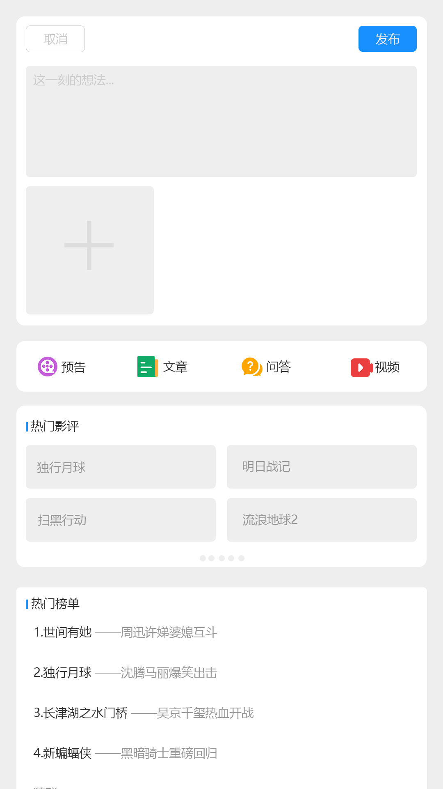

# vue3-ts-movie-circle-app-ui
使用最新流行的vue3+typescript+hook搭建的电影圈webapp项目，嵌入到电影app中的电影圈小程序，持续开发中

================================界面预览================================

================================界面预览================================
后端接口项目和sql语句：https://github.com/wuyuanwuhui99/springboot-app-service

flutter在线电影项目：https://github.com/wuyuanwuhui99/flutter-movie-app-ui

react native版本参见: https://github.com/wuyuanwuhui99/react-native-app-ui

harmony鸿蒙版本参见: https://github.com/wuyuanwuhui99/Harmony_movie_app_ui

vue在线音乐项目：https://github.com/wuyuanwuhui99/vue-music-app-ui

在线音乐后端项目：https://github.com/wuyuanwuhui99/koa2-music-app-service

vue3+ts明日头条项目：https://github.com/wuyuanwuhui99/vue3-ts-toutiao-app-ui
